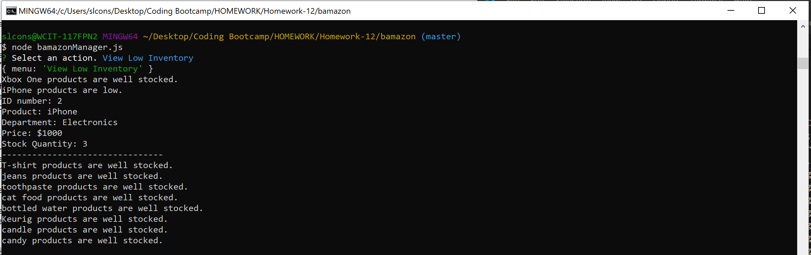

# Bamazon
## Created By
Created by Samantha Considine. Sole developer.

## About
Created an Amazon-like storefront using MySQL as the store database and Node as a means of communicating user input. There are separate applications designed for customers using the application and for managers using the application. 

The database stores information about the products including:
* a unique ID for each product
* product's name
* product's department
* product's price
* stock quantity of the product

Customers are shown all the products available and the price and IDs associated with each. The app will then prompt the user for the ID of the item they would like to buy and how much of the product they would like to pruchase.

If there is enough stock quantity of the item to support the customer's order, the order is fulfilled and database is updated. The customer is then showed the total cost of their order.

Managers using the application have four commands they can give, including:
* View Products for Sale
* View Low Inventory
* Add to Inventory
* Add New Product

### View Products for Sale
Lists all available items in the database including their ID, name, price, and stock quantity.

### View Low Inventory
Checks the available stock quantity of each item. If the item has less than 5 available, the app will print a message. If the item has more than 5 total products available, the app will say that it is fully stocked. 

### Add to Inventory 
Prompts the manager to restock any item that is already in the store.

### Add New Product
Prompts the manager and walks them through adding a completely new product to the store. 

## Instructions
With the files accessible in the terminal run the following in the command line for the customer application: 
'node bamazonCustomer.js'

Or run the following in the command line for the manager application: 
'node bamazonManager.js'

## See it in action!
### Customer Application
* Select the ID of the item you would like to purchase.
* Select the quantity of the item you would like to purchase.
* Bamazon will then update you with the total price of your order or tell you that it cannot make the order. 

### Manager Application - View Products for Sale
* Shows the manager all data about all the products available for sale.

### Manager Application - View Low Inventory
* If there is no low inventory, Bamazon will look like this: 

* If there is low inventory, Bamazon will show you the data regarding the low inventory products. 
* Ran the view all product command so that the updated stock can be seen.

### Manager Application - Add to Inventory
* Select the product you would like to add inventory for.
* Add the desired inventory. 
* Ran the view low inventory command to make sure the product had been updated.

### Manager Application - Add New Product
* Input all the information for the new product being added.
* Ran the view all products command to see the new product.

## Technology Used
* JavaScript
* Node.js
* MySQL
* npm packages:
    - mysql
    - inquirer